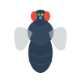
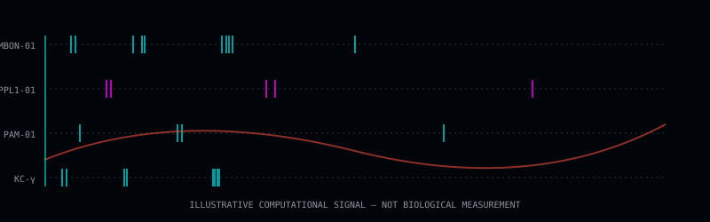
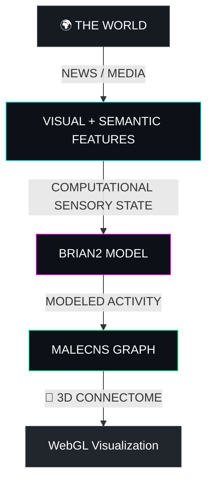
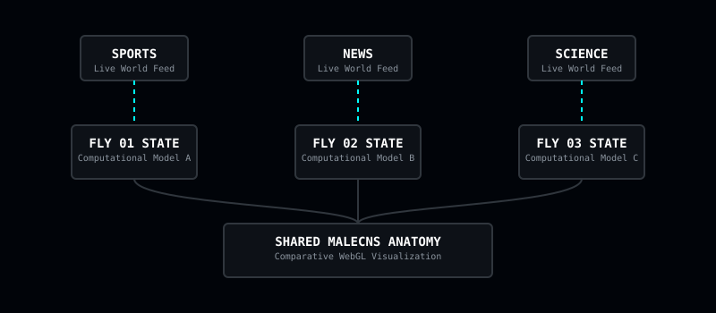

<div align="center">
  
  <h1>NeuroFly</h1>
  <h3>What happens when a fly watches the world?</h3>
</div>

<br/>

> Imagine being able to make a fly watch the news and see how it would react.
>
> I know that sounds absurd.
>
> But that's actually possible now.

📖 **[Read the full story behind NeuroFly on LinkedIn](https://www.linkedin.com/pulse/imagine-being-able-make-fly-watch-news-see-how-would-react-nihal-txmac)**

## 🪰 So I Made the Fly Watch Something.

<div align="center">
  <video src="https://github.com/user-attachments/assets/38efea60-8202-4478-a8f0-35512c354876" autoplay loop muted playsinline width="100%"></video>
</div>

The original idea was simple:

What if a fly could watch the same world that we watch?

Not a cartoon fly.

Not a fictional brain.

A fly represented using a real connectome, connected to a computational neural model.

NeuroFly uses a real *Drosophila melanogaster* MaleCNS connectome as the structural foundation for a computational model. We pump live video and text feeds from the real world straight into a spiking neural network modeled directly over this anatomical wiring.

---

## 🎬 WATCH THE FLY WATCH THE WORLD

https://github.com/user-attachments/assets/de23fade-b22a-41fb-ab1b-4e99bf913b4f

---

## 🧠 What Is Happening Inside the Fly?

When a live world feed is processed, NeuroFly extracts visual and semantic features—brightness, edge density, novelty, and valence. These computational features are mathematically translated into sensory stimuli (Poisson spike rates) that are injected into the visual and olfactory projection neurons of the modeled graph. 

<div align="center">
  
</div>

### The Computational Pipeline



---

## 🪰🪰🪰 Three Flies. Three Worlds.

What happens if one fly watches live sports, while another watches breaking news, and a third watches a space launch?

<div align="center">
  
</div>

NeuroFly allows you to run multiple independent computational states over the single shared anatomical graph structure. Compare their computational states, sensory adaptation, and abstract modulatory levels in a synchronized real-time view.

*(Note: These are independent computational model instances, not biological experiments with actual living flies.)*

---

## 🧬 What Is Actually Real?

NeuroFly provides an aesthetic, computational exploration of empirical anatomy. 

| Layer | Status |
|---|---|
| MaleCNS structure | **REAL DATA** |
| Neuron identities | **REAL DATA** |
| Structural connectivity | **REAL DATA** |
| World/media input | **REAL INPUT** when available |
| Feature extraction | **COMPUTATIONAL** |
| Spiking activity | **MODEL-DERIVED** |
| Adaptation | **MODEL-DERIVED** |
| Dopaminergic state | **MODEL-DERIVED** |
| Consciousness | **NOT CLAIMED** |

<br/>

<div align="center">
  <h3 style="color: #00ffff; font-family: monospace;">The wiring is real.<br/>The world can be real.<br/>The reaction is modeled.</h3>
</div>

<br/>

**What it does NOT claim:**
- It does **not** read the subjective mind of a fly.
- It does **not** measure a living fly's dopamine levels or empirical neural activity.
- It does **not** prove that a fly experiences human-like emotion based on the visualized state.

---

## 🏗 How Does It Work?

NeuroFly is a heavily decoupled system designed to pump millions of graph vertices to your GPU while simultaneously running a spiking simulation in Python.

- **The Data Layer:** Live APIs pull world streams (like YouTube) and extract statistical visual/semantic feature vectors.
- **The Simulation Layer:** Python daemon utilizing the `Brian2` Leaky Integrate-and-Fire engine simulates the graph state.
- **The Structural Layer:** `NeuPrint` and the `male-cns:v1.0` dataset provide the graph topology.
- **The Presentation Layer:** A Node.js/Express backend serves state to a React frontend, mapping the simulated data onto a WebGL (Three.js) rendering of the actual neuron skeletons.

---

## 🚀 How Do I Run It?

Ensure you have Python 3.10+ and Node.js v18+.

**1. Clone & Install Backend**
```bash
git clone https://github.com/iamnih4l/NeuroFLY.git
cd NeuroFLY
python -m venv venv
# Windows: .\venv\Scripts\activate | macOS/Linux: source venv/bin/activate
pip install -r requirements.txt
```

**2. Install Frontend**
```bash
cd frontend
npm install
cd ..
```

**3. Configure Environment**
Copy `.env.example` to `.env`.
```bash
cp .env.example .env
```

**4. Start NeuroFly**
Start the backend server:
```bash
cd frontend/server
node server.js
```
Start the frontend UI (in a new terminal):
```bash
cd frontend
npm run dev
```

For advanced setup and data management, see the [Setup Guide](docs/SETUP.md).

---

## 🧪 Want to Make the Fly Stranger?

NeuroFly is open source. 

If you are interested in computational neuroscience, connectomics, 3D visualization, simulation, weird experiments, or creative coding—we welcome you to break it and build upon it! 

Check out [CONTRIBUTING.md](CONTRIBUTING.md) and our [Development Guide](docs/DEVELOPMENT.md) to get started.

---

## 📜 License & Credits

- **Code License:** MIT
- **Data Source:** The `male-cns:v1.0` connectome is graciously provided by Google Research and HHMI Janelia. Please adhere to the Janelia FlyEM licensing requirements when publishing research based on this data. Read more in our [Data Provenance Guide](docs/DATA.md).
