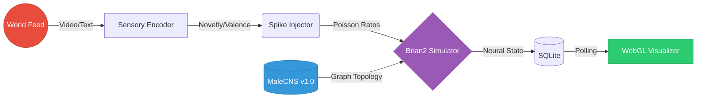
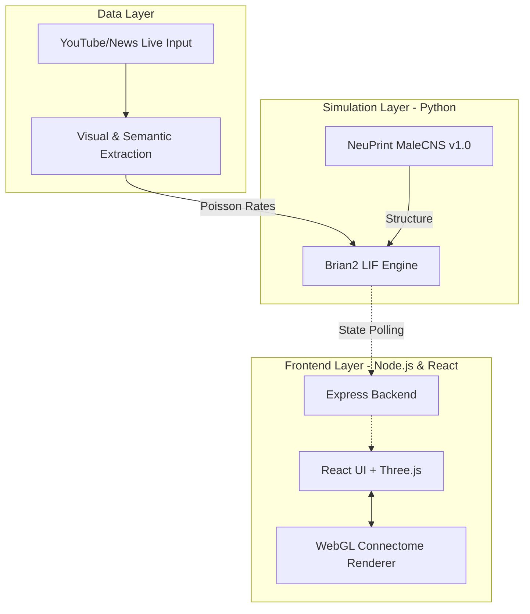
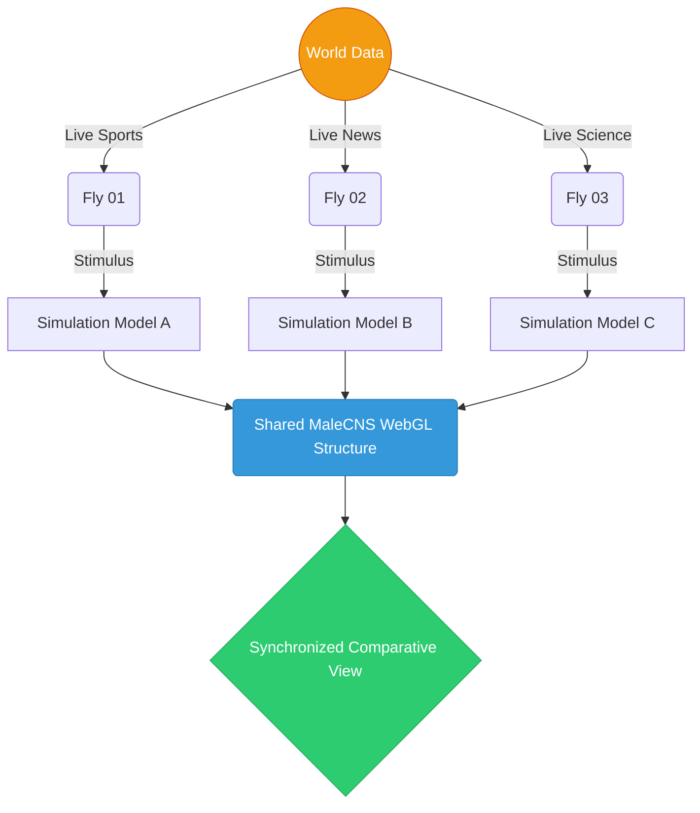

<div align="center">
  
  <h1>NeuroFly</h1>
  <h3>What happens when a fly watches the world?</h3>
</div>

<br/>

> Imagine being able to make a fly watch the news and see how it would react.
>
> I know that sounds absurd.
>
> But that's actually possible now.

**Meet NeuroFly.** 

NeuroFly asks a slightly different question: What happens when we give a computational neural model built on a *real fly connectome* something to watch?

NeuroFly combines real *Drosophila melanogaster* male CNS connectome data with a computational spiking neural model and real-world media inputs to explore how different stimuli produce different modeled brain states.

---

## 🎬 See it in Action

<video src="https://github.com/iamnih4l/NeuroFLY/raw/main/assets/neurofly/demo.mp4" autoplay loop muted playsinline width="100%"></video>

*(Note: If the video above does not play, ensure you have uploaded `demo.mp4` to `assets/neurofly/demo.mp4` in your repository!)*

---

## 🧠 What is Real vs Computational?

NeuroFly explores the intersection of empirical anatomy and computational dynamics.

- 🔬 **The anatomy is real.** The structural foundation of the network is the `male-cns:v1.0` dataset from Janelia FlyEM. The somas, skeletons, and synaptic graphs exist exactly as mapped in biology.
- 📡 **The stimulus can be real.** The system takes live video feeds (like YouTube news or sports) and extracts visual/semantic features to drive sensory neurons.
- ⚡ **The neural activity is modeled.** We simulate dynamics using the Brian2 Leaky Integrate-and-Fire engine. The spikes, habituation, and "dopaminergic" states you see are *computationally derived* from the structural graph's response to the stimulus. 

---

## 🏗 System Architecture & Flow

NeuroFly is a heavily decoupled system designed to pump millions of graph vertices to your GPU while simultaneously running a spiking simulation in Python.

### 1. Data Flow



### 2. Tech Stack Layers



---

## 🪰 Real-Time Multi-Fly Comparison

What happens if one fly watches live sports, while another watches breaking news, and a third watches a space launch?

NeuroFly allows you to run multiple independent computational states over the single shared anatomical graph structure:



Compare their computational states, sensory adaptation, and abstract modulatory (dopaminergic) levels in real-time.

---

## 🚀 Quick Start

Ensure you have Python 3.10+ and Node.js v18+.

**1. Clone & Install Backend**
```bash
git clone https://github.com/iamnih4l/NeuroFLY.git
cd NeuroFLY
python -m venv venv
# Windows: .\venv\Scripts\activate | macOS/Linux: source venv/bin/activate
pip install -r requirements.txt
```

**2. Install Frontend**
```bash
cd frontend
npm install
cd ..
```

**3. Configure Environment**
Copy `.env.example` to `.env`. (If using Local Data Mode, add your NeuPrint token here).
```bash
cp .env.example .env
```

**4. Start NeuroFly**
Run the backend API:
```bash
cd frontend/server
node server.js
```
Run the frontend (in a new terminal):
```bash
cd frontend
npm run dev
```

For full setup (including massive local data downloads), see [Setup Guide](docs/SETUP.md).

---

## 🔬 What NeuroFly Does — and Doesn't Claim

NeuroFly provides an aesthetic, computational exploration of empirical anatomy.

**What it does NOT claim:**
- It does **not** read the subjective mind of a fly.
- It does **not** measure a living fly's dopamine levels or empirical neural activity.
- It does **not** prove that a fly experiences human-like emotion based on the visualized state.

Read more in our [Science Guide](docs/SCIENCE.md) and [Data Provenance Guide](docs/DATA.md).

---

## 🤝 Open Source & Contributing

NeuroFly is an OPEN SOURCE project! 

We welcome contributions from developers, researchers, and enthusiasts. Whether you want to improve the WebGL rendering, refine the spiking neural models, or add new input feeds, we'd love your help.

Check out [CONTRIBUTING.md](CONTRIBUTING.md) and our [Development Guide](docs/DEVELOPMENT.md) to get started!

---

## 📜 License & Credits

- **Code License:** MIT
- **Data Source:** The `male-cns:v1.0` connectome is graciously provided by Google Research and HHMI Janelia. Please adhere to the Janelia FlyEM licensing requirements when publishing research based on this data.
