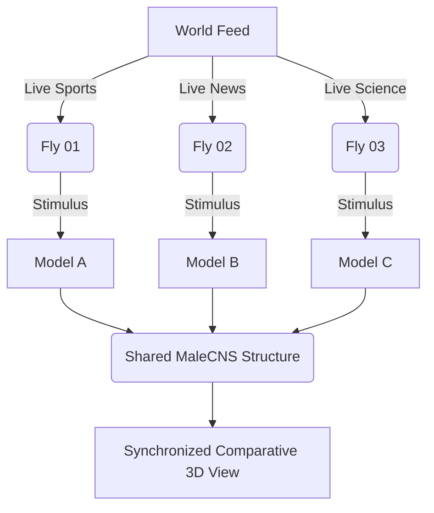

# NeuroFly System Architecture

NeuroFly is designed as a decoupled two-mode system (Local and Web/API) combining data extraction, real-time computational modeling, and WebGL visualization.

## 1. High-Level Architecture

The architecture separates the data ingestion, simulation engine, and visualization frontend to ensure that heavy visualization load does not block the spiking neural network calculation.

```mermaid
flowchart TD
    subgraph Data Layer
        A[YouTube/News Live Input] --> B[Visual & Semantic Extraction]
    end

    subgraph Simulation Layer (Python)
        B --> |Poisson Rates| C[Brian2 LIF Engine]
        D[(NeuPrint MaleCNS v1.0)] --> |Structure| C
        C --> |Spike Trains & State| E[NeuroStateManager]
    end

    subgraph Frontend Layer (Node.js & React)
        E -.-> |SQLite Polling| F[Express Backend]
        F -.-> G[React UI + Three.js]
        G <--> H[WebGL Connectome Renderer]
    end
```

## 2. Real-Time Multi-Fly Architecture

In the Multi-Fly comparison mode, the system isolates multiple computational states while sharing the underlying MaleCNS structural graph to save memory.



## 3. Core Components

1. **Data Layer (Python):** 
   - `news_provider.py` & `youtube_provider.py` extract live multimodal inputs.
   - Calculates semantic dimensions (novelty, salience, valence) and maps them to sensory stimuli.

2. **Simulation Layer (Python):** 
   - `NeuroFlySimulator` (using `brian2`).
   - Translates sensory inputs into Poisson spike trains injected into the olfactory/sensory populations.
   - Outputs computational states like adaptation, habituation, and simulated dopamine levels.
   - Runs as a persistent background daemon in multi-fly mode to retain memory state across polls.

3. **Frontend Layer (TypeScript/React):** 
   - A cinematic, immersive 3D HUD built with React and Three.js. 
   - It streams `.nbf` (NeuroFly Binary Format) geometries directly to the GPU using zero-copy typed arrays.
   - It does *not* run the neural simulation; it polls the Express backend to animate the visual representation.

## 4. Compute Requirements

- **Backend / Simulation:** Node.js & Python 3.10+. Minimum 16GB RAM for local cache handling. 
- **Frontend / Rendering:** A dedicated GPU (e.g., RTX 3060) is strongly recommended to render the 3D connectome at 60 FPS using WebGL without dropping frames during cinematic transitions. 
